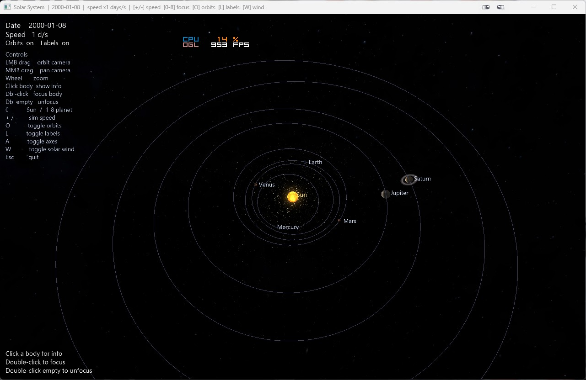

# 🌌 Solar System

A real-time, physically-flavoured 3D simulation of our Solar System, written in C# 14 on .NET 10 with **OpenTK 4** (OpenGL 4.5). Eight planets orbit the Sun on Keplerian paths, spin on tilted axes, cast Phong-shaded highlights, drag a glittering solar wind in their wake, and float against a 360° Milky Way sky.



---

## ✨ Features

- **Keplerian orbits** — eccentricity, inclination, ascending node, argument of periapsis, mean anomaly at J2000. Position is solved from Kepler's equation each frame.
- **Eight real planets** with 8K diffuse textures (procedural fallback if a file is missing).
- **The Moon** — orbits Earth on a 27.32-day inclined circle, tidally locked (same face always toward Earth).
- **Axial rotation & tilt**
- **Phong-lit shading** from a single point light at the origin.
- **Saturn's rings** — alpha-blended texture ring, properly tilted with the planet.
- **Procedural Milky Way sky** rendered from a fullscreen quad via inverse view-projection.
- **Solar wind** — additively-blended particle system streaming radially outward from the Sun, fading from yellow-young to orange-old.
- **Bitmap-rasterized HUD** — real Segoe UI glyphs (GDI+) packed into an RGBA atlas, used for body labels and the on-screen panels.
- **Click-to-pick** any body for an info panel; **double-click** to focus the camera on it.
- **Focus cycling** with number keys; orbiting/panning/zoom with the mouse.
- **Time control** — variable simulation speed from 0.1 d/s to 1000 d/s.

---

## 🎮 Controls

| Input | Action |
|---|---|
| **LMB drag** | Orbit camera around target |
| **MMB drag** | Pan target |
| **Mouse wheel** | Zoom |
| **LMB click** | Select body (shows info panel) |
| **LMB double-click body** | Focus camera on body |
| **LMB double-click empty space** | Stop following (free camera) |
| **0** / **Numpad 0** | Reset to Sun view |
| **1 – 8** | Focus Mercury … Neptune |
| **+ / =** | Speed up time (×1.5, capped at 1000 d/s) |
| **− / _** | Slow down time (÷1.5, floor 0.1 d/s) |
| **O** | Toggle orbit lines |
| **L** | Toggle labels |
| **A** | Toggle planet axis lines |
| **W** | Toggle solar wind |
| **Esc** | Quit |

---

## 🚀 Build & Run

### Requirements

- **.NET 10 SDK** (preview or later)
- **Windows** (uses GDI+ via `System.Drawing.Common` for font rasterization)
- A GPU supporting OpenGL 4.5

### Run

```powershell
git clone https://github.com/VahaC/SolarSystem.git
cd SolarSystem
dotnet run -c Release
```

### Textures

Place 8K Solar System textures in a `textures/` folder next to the executable. Files used:

```
textures/
├── 8k_sun.jpg
├── 8k_mercury.jpg
├── 8k_venus_atmosphere.jpg
├── 8k_earth_daymap.jpg
├── 8k_mars.jpg
├── 8k_jupiter.jpg
├── 8k_saturn.jpg
├── 8k_uranus.jpg
├── 8k_neptune.jpg
└── 8k_moon.jpg
```

If a file is missing, the planet is rendered with a procedurally-tinted placeholder texture, so the simulation always runs.

> Public-domain 8K planet maps are available from **[Solar System Scope](https://www.solarsystemscope.com/textures/)**.

---

## 🧱 Architecture

```
Program.cs              entry point; configures NativeWindowSettings (4.5 Core)
SolarSystemWindow.cs    GameWindow: input, update loop, render orchestration
Renderer.cs             OpenGL resources & shader pipelines
                        (Sun, planets, orbits, rings, sky, axes, text)
Camera.cs               yaw/pitch/distance orbital camera, mouse handling
Planet.cs               planet data + factory (CreateAll: 8 real bodies)
OrbitalMechanics.cs     Kepler solver, heliocentric → world-space scaling
SolarWind.cs            CPU particle pool + GL point-sprite renderer
BitmapFont.cs           GDI+ glyph atlas (Segoe UI 32px, RGBA8)
TextureManager.cs       texture loader + procedural / ring fallbacks
ShaderProgram.cs        thin GL shader compile/link helper
```

### Rendering pipeline (per frame)

1. Clear color + depth.
2. Sky — fullscreen quad samples a procedural starfield via `uInvViewProj`.
3. Orbit lines (line strips per planet).
4. Sun (textured emissive sphere).
5. Planets (Phong-lit textured spheres).
6. Saturn's ring (alpha-blended quad).
7. **Solar wind particles** (additive `(SrcAlpha, One)`, depth-write off).
8. Optional debug axes.
9. Body labels (billboarded text).
10. HUD overlay (date, speed, controls help, info panel).

### Solar wind details

- Pool of up to 6000 particles, each `(Pos, Vel, Life, MaxLife)`.
- Emission rate ≈ 1500 particles/s with fractional accumulator for smoothness.
- Spawn point: Sun surface (radius × 1.05).
- Direction: uniform on a sphere via inverse-CDF (`acos(1−2u)`).
- Speed: 35 world-units/s ± 40 % jitter; lifetime 6 s ± 40 %.
- GPU upload: live particles tightly packed into a single VBO via `BufferSubData`.
- Vertex shader sets `gl_PointSize = clamp(220/dist, 1, 6) × age`, fragment shader draws a soft round point with color lerping orange-red → yellow as `Life01` rises.

---

## 📦 Dependencies

| Package | Version | Purpose |
|---|---|---|
| `OpenTK` | 4.8.2 | OpenGL bindings, windowing, input |
| `StbImageSharp` | 2.27.13 | JPG/PNG decoding for textures |
| `System.Drawing.Common` | 9.0.0 | GDI+ font rasterization (Windows) |

---

## 🌍 The Eight Planets

| # | Name | Semi-major (AU) | Period (yr) | Tilt (°) | Notes |
|---|---|---|---|---|---|
| 1 | Mercury | 0.387 | 0.241 | 0.034 | — |
| 2 | Venus   | 0.723 | 0.615 | 177.4 | retrograde spin |
| 3 | Earth   | 1.000 | 1.000 | 23.44 | — |
| 4 | Mars    | 1.524 | 1.881 | 25.19 | — |
| 5 | Jupiter | 5.203 | 11.86 | 3.13  | — |
| 6 | Saturn  | 9.537 | 29.46 | 26.73 | rings |
| 7 | Uranus  | 19.19 | 84.01 | 97.77 | retrograde / sideways |
| 8 | Neptune | 30.07 | 164.8 | 28.32 | — |

Distances are non-linearly compressed to world space (`world = K · a^0.45`) so all eight bodies stay visible without dwarfing the inner planets.

---

## 📝 License

MIT for the source code. Planet textures are © their respective authors (see Solar System Scope license — generally CC-BY 4.0). This project is for educational and entertainment use.

---

## 🙏 Credits

- **Solar System Scope** — public-domain 8K planet maps.
- **OpenTK** team — first-class .NET OpenGL bindings.
- **StbImageSharp** — pure-managed image decoding.
- **NASA / JPL** — orbital element references.
