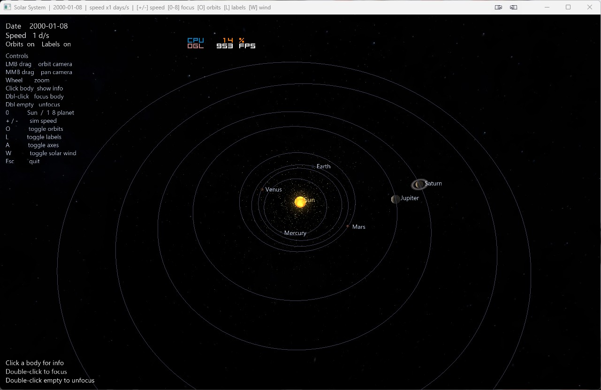

# 🌌 Solar System

A real-time, physically-flavoured 3D simulation of our Solar System, written in C# 14 on .NET 10 with **OpenTK 4** (OpenGL 4.5). Eight planets orbit the Sun on Keplerian paths, spin on tilted axes, cast Phong-shaded highlights, drag a glittering solar wind in their wake, and float against a 360° Milky Way sky.



> 📖 Full feature reference (English / Ukrainian):
> **[docs/FEATURES.md](docs/FEATURES.md)** · **[docs/FEATURES.uk.md](docs/FEATURES.uk.md)**.
> Roadmap and planned items: **[ROADMAP.md](ROADMAP.md)**.

---

## ✨ Features

### Bodies & motion
- **Keplerian orbits** — eccentricity, inclination, ascending node, argument of periapsis, mean anomaly at J2000. Position is solved from Kepler's equation each frame.
- **Eight real planets** with 8K diffuse textures (procedural fallback if a file is missing).
- **Five IAU dwarf planets** — Ceres, Pluto, Haumea, Makemake, Eris, with full J2000 elements; they reuse the same orbit / trail / picking pipeline as the majors.
- **Major moons** — Earth's Moon plus the Galileans (Io, Europa, Ganymede, Callisto) and Titan, each on its own circular inclined orbit around its host planet.
- **Asteroid belt** — 8000 rocks with precomputed Keplerian elements, advanced per frame by a Newton-Raphson Kepler solve, rendered as additively-blended `GL_POINTS`.
- **Comet catalogue** — a data-driven set of real comets (Halley, Hale–Bopp, NEOWISE, Encke) loaded from `data/comets.json`, each with its own orbit polyline and CPU-particle ion/dust tail that ignites near perihelion (intensity ∝ 1/r).
- **Tidal-lock arrows** — additive arrow on every spin-locked moon (Earth's Moon, Galileans, Titan) pointing at its host, visualising permanent near-side orientation.
- **Planetary alignment indicator** — union-find over heliocentric longitudes flags every group of ≥3 majors within ~12°; a glowing line links them and a top-right banner names the participants.
- **Physics sandbox** — three simulation modes: *Ephemeris* (the analytic default), *Physics* (one N-body integration for the Sun, planets, dwarfs, Moon, Galileans and Titan, with comets and the asteroid belt as test particles) and *Compare* (physics plus translucent ephemeris ghosts). G, the Sun's mass, the gravity-law exponent, the speed of light and every body's mass are live sliders, and bodies that touch merge — see [Physics sandbox](#physics-sandbox-s17).
- **Axial rotation & tilt**, including retrograde spin for Venus/Uranus.
- **Data-driven** — planet & dwarf elements live in `data/planets.json` (with comments + trailing commas); the built-in tables are a fallback.

### Rendering
- **Phong-lit shading** from a single point light at the origin (the Sun).
- **HDR + Bloom post-process** — the scene is rendered to an `RGBA16F` FBO, then bright-pass + 6-pass separable Gaussian blur + additive composite produce a glow halo on the Sun, flares and particles.
- **Earth cloud layer** — second alpha-blended sphere at `1.012 ×` Earth radius, slowly counter-rotating (alpha derived from cloud-texture luminance, so a plain JPG works).
- **Earth night-side city lights** — emissive nightmap added to the dark hemisphere via `1 − smoothstep(-0.05, 0.2, NdotL)`; smoothly fades across the terminator.
- **Saturn's rings + mutual shadow** — alpha-blended texture ring, properly tilted with the planet. The `PlanetFS` casts a ray from each lit Saturn fragment toward the Sun and attenuates lighting by the ring's per-radius opacity; the `RingFS` does the inverse ray-vs-sphere test so Saturn's shadow falls on the rings.
- **Lens flare** — screen-space additive ghosts along the Sun→centre axis when the Sun is roughly looked-at; fades with NDC distance and view alignment.
- **Sun corona / granulation** — `sun.frag` runs a 4-octave fbm of the world-space normal (drifting in time) plus a low-frequency pulse, so the disc breathes with hot/cool granules instead of staying a static texture.
- **Polar auroras** — additive ribbon mesh at Earth (green) and Jupiter (magenta/violet) poles, with curtain waves + per-vertex shimmer animated against `GLFW.GetTime()`; intensity boosted while the solar wind is on, and the bright crests feed the bloom pass.
- **PBR planet shading** — Cook-Torrance / GGX with Schlick-GGX G, Schlick F and per-body roughness/metallic constants (gas giants smoother, rocky bodies rougher, the Moon nearly Lambertian); legacy Phong lobe remains as the off-fallback.
- **Specular ocean mask** — Earth's `8k_earth_specular_map.{png,jpg,tif}` (TU3) gates the specular term so only oceans glint while continents stay matte.
- **Solar wind & flares** — instanced-quad particle systems streaming radially from the Sun (yellow→orange) and erupting sprites that feed the bloom pass.
- **Equirectangular Milky Way sky** when `8k_stars_milky_way.jpg` is present (procedural starfield otherwise).
- **Adaptive star brightness/saturation** — sky shader is dimmed in deep space and saturation-boosted close to a body, so the panorama doesn't drown out distant planets.
- **Constellation overlay** — RA/Dec line endpoints from `data/constellations.json`, rendered skybox-style at infinity (Orion, Ursa Major, Cassiopeia, Cygnus, Lyra, Crux, Scorpius, Leo).
- **Planet trails** — per-body 200-sample ring buffer rasterised as a fading line strip (alpha quadratic in age); auto-clears on direction reverse / scale toggle / date jump.
- **Cross-platform bitmap HUD** — SkiaSharp glyph atlas (Segoe UI → DejaVu Sans → Arial → default fallback chain) packed into an RGBA atlas, used for body labels and on-screen panels.

### Real-scale mode (`R`)
- **Logarithmic depth** — every 3D shader writes `gl_Position.z = (log2(1 + w) · Fcoef − 1) · w` (Outerra-style), eliminating z-fighting across the ~10⁷ near/far ratio.
- **Screen-space minimum body size** — `PlanetVS` expands sphere vertices outward from the planet centre when the projected radius drops below ~1 px, so distant bodies never collapse to nothing.

### Interaction
- **Click-to-pick** any body (planet / dwarf / Moon / Galilean / Titan / comet) for an info panel; **double-click** to focus the camera on it.
- **Smooth focus transitions** — `Camera.Target` and `Distance` lerped over ~0.5 s with a smoothstep ease, tracking the moving body en route.
- **Hover tooltip** — name + heliocentric distance shown next to the cursor.
- **Name search** — `Ctrl+F` opens a modal prompt with live prefix/substring matching across every focusable body.
- **Date seek** — press `J` to jump to an absolute `YYYY-MM-DD` or a signed delta in days (`+30`, `-365`).
- **Time control** — variable simulation speed, pause (`Space`), forward / backward direction (`,` / `.`).
- **Light-time toggle** — delays each planet's spin angle by `r/c` so the day/night terminator falls where the photons currently illuminating it left the Sun (~2° at Earth, ~90° at Neptune).
- **Screenshot** (`F12`) saves a PNG of the post-bloom composite to `screenshots/`.
- **HUD overlay** (`~`) shows FPS, scale mode, and live particle / asteroid counts.
- **Persisted UI state** — camera, sim time and every registry toggle (`Features: {id: bool}`) round-trip via `%AppData%/SolarSystem/state.json`; pre-registry saves are migrated automatically.
- **Feature registry** — one list (`FeatureRegistry`) drives the F1 settings panel (tabs, presets, hotkey hints, descriptions), the `Ctrl+K` command palette, the bottom toolbar, the generated help overlay, `data/keybindings.json` overrides and `state.json`.
- **Focus cycling** with number keys; orbiting / panning / zoom with the mouse.

> 📍 Looking for what's coming next? See **[ROADMAP.md](ROADMAP.md)** for planned features and improvement ideas.

---

## 🎮 Controls

Every toggle and command lives in one **feature registry** (`FeatureRegistry.cs`), and three
mouse-first surfaces are generated from it — so you never have to memorise a key:

- **F1 — Settings panel.** Six tabs (Bodies · Simulation · Effects · Post-FX · Interface · Developer),
  every switch as a checkbox with its hotkey on the right and a one-line description in the footer.
  Scene tabs also carry **presets** (Cinematic / Realistic / Performance / Minimal) plus
  *Reset tab* / *All on* / *All off*. `←` `→` switch tabs, `Esc` closes.
- **Ctrl+K — Command palette.** Type any part of a setting or command name (`aur` → *Aurora*,
  `screen` → *Screenshot*, `focus ma` → *Focus: Mars*), `Enter` toggles / runs, `Esc` closes.
- **Bottom toolbar.** Pause, speed ±, direction, Orbits / Labels / Trails / Real scale, and buttons
  for the two menus. Hide it from Interface → Toolbar.

Only the essentials keep a default key. Everything else is reachable from the panel or the palette,
and any id can be (re)bound in **`data/keybindings.json`** (chords like `Ctrl+Shift+P`, `F4`, `~`, `Num1`;
the file ships with the old single-letter layout commented out for anyone who wants it back).

| Input | Action |
|---|---|
| **LMB drag** | Orbit camera around target |
| **MMB drag** | Pan target |
| **Mouse wheel** | Zoom (scrolls the settings panel when the cursor is over it) |
| **LMB click** | Select body (shows info panel) |
| **LMB double-click body** | Focus camera on body (smooth 0.5 s transition) |
| **LMB double-click empty space** | Stop following (free camera) |
| **F1** | Settings panel |
| **Ctrl+K** | Command palette |
| **Tab** | Cycle help overlay: full → minimal → hidden |
| **Space** | Pause / resume |
| **+ / −** | Speed up / slow down time (×1.5 steps, 0.1 … 1000 d/s) |
| **,** / **.** | Play backward / forward (magnitude preserved) |
| **0** / **1 – 8** | Focus the Sun / Mercury … Neptune (numpad works too) |
| **O** / **L** / **T** | Toggle orbit lines / labels / planet trails |
| **R** | Toggle real-scale mode (km-derived radii + log depth) |
| **J** | Date-seek prompt (`YYYY-MM-DD` or `±days`) |
| **Ctrl+F** | Search bodies by name |
| **Ctrl+E** / **Ctrl+Shift+E** | Next / previous eclipse-transit bookmark |
| **F3** | Bookmarks sidebar |
| **Ctrl+1‥9** / **Ctrl+Shift+1‥9** | Record / clear a camera waypoint |
| **Shift+P** / **Ctrl+Shift+P** | Play / clear the camera path |
| **F2** | Cycle UI language — dropped `data/lang.<code>.json` files are auto-detected |
| **F9** | Start / stop video recording (ffmpeg) |
| **F10** | Per-pass profiler overlay |
| **F12** | Screenshot to `screenshots/` |
| **~** | FPS / particle-count HUD |
| **Alt+Enter** | Borderless fullscreen |
| **Esc** | Close the open panel / prompt; on an empty screen press **twice** within 2 s to quit |

Unbound by default (F1 panel · Ctrl+K · `keybindings.json`): axes, dwarf planets, probes, Lagrange
points, constellations, tidal-lock arrows, alignment indicator, meteor showers, light-time delay,
simulation mode (Ephemeris / Physics / Compare), physics constants and masses, physics diagnostics,
solar wind, solar flares, sun corona, aurora, atmosphere, eclipses, PBR, ocean specular,
bloom, auto-exposure, FXAA, lens flare, timeline scrubber, audio cues, GLSL hot-reload, GPU asteroid belt.

---

## 🚀 Build & Run

### Requirements

- **.NET 10 SDK** (preview or later)
- **Windows / Linux / macOS** — font rasterisation runs on SkiaSharp (with `SkiaSharp.NativeAssets.Linux.NoDependencies` for Linux); the `F12` screenshot path now uses SkiaSharp too (Q11), so the entire pipeline is cross-platform.
- A GPU supporting OpenGL 4.5

### Run

```powershell
git clone https://github.com/VahaC/SolarSystem.git
cd SolarSystem
dotnet run -c Release
```

### Continuous integration (A10)

Every push and PR to `main` runs `.github/workflows/ci.yml` — a matrix of
`windows-latest`, `ubuntu-latest` and `macos-latest` that restores, builds
(`-c Release`) and `dotnet test`s the xUnit suite. The workflow can also be
triggered manually from the **Actions** tab (`workflow_dispatch`), and
documentation-only changes (`**/*.md`, `docs/**`) are excluded via
`paths-ignore` so README / roadmap edits don't burn matrix minutes.

### Headless render / video export (A7)

The same binary can render a deterministic PNG sequence (and optionally encode
it to MP4 via `ffmpeg`) without showing a window:

```powershell
# 365 frames covering one Earth year, 1 day per frame, 60 fps mp4
dotnet run -c Release -- --render --from 2025-01-01 --to 2026-01-01 `
    --dt 1.0 --fps 60 --out render --ffmpeg ffmpeg --video-out year.mp4
```

Flags: `--from / --to <YYYY-MM-DD>`, `--dt <days/frame>`, `--frames N`
(overrides `--to`), `--fps N`, `--out <dir>`, `--ffmpeg <path>`,
`--video-out <file.mp4>`, `--real-scale`, `--physics` (seed the N-body world at
`--from` and integrate exactly `--dt` days per frame). Sim time is pinned per frame so the
output is identical regardless of how fast the offscreen loop runs; persisted
UI state is loaded for camera / toggles but not overwritten.

### Native AOT publish (A11)

The project is trim- / AOT-clean: `IsAotCompatible`, `IsTrimmable`,
`EnableTrimAnalyzer` and `EnableSingleFileAnalyzer` are on for every build, and
every `System.Text.Json` call goes through a source-generated
`SolarSystemJsonContext` (see `JsonContext.cs`) so no reflection-based metadata
resolver is pulled in at runtime. To produce a single self-contained native
binary:

```powershell
dotnet publish SolarSystem.csproj -c Release -r win-x64   -p:PublishAot=true
# Linux / macOS:
dotnet publish SolarSystem.csproj -c Release -r linux-x64 -p:PublishAot=true
dotnet publish SolarSystem.csproj -c Release -r osx-arm64 -p:PublishAot=true
```

AOT is purely build-time — there is no F1 / keyboard toggle. The standard
`dotnet run` developer loop continues to use the JIT for fast iteration.
Full reference in [docs/FEATURES.md#a11--native-aot](docs/FEATURES.md#a11--native-aot)
([UA](docs/FEATURES.uk.md#a11--native-aot)).

### Per-frame profiler overlay (A12)

Press **F10** (or tick the row in the F1 settings panel) to overlay a
bottom-right card with per-pass GPU + CPU timings sampled from
`GL_TIME_ELAPSED` queries — the renderer is split into `sky`, `planets`,
`particles`, `bloom` and `ui` passes, each EMA-smoothed so the readout
stays legible. Queries are triple-buffered so the GL thread never stalls
on `glGetQueryObject`; drivers that don't expose timer queries
automatically fall back to CPU-only numbers. The toggle is persisted in
`state.json`. Full reference in
[docs/FEATURES.md#a12--per-frame-profiler-overlay](docs/FEATURES.md#a12--per-frame-profiler-overlay)
([UA](docs/FEATURES.uk.md#a12--per-frame-profiler-overlay)).

### Physics sandbox (S17)

Everything can move by one set of equations instead of analytic formulas, and you
can bend the constants while it runs. **F1 → Simulation → *Simulation mode***
(or `Ctrl+K` → "simulation mode") switches between:

- **Ephemeris** — the historical default: Kepler elements for planets, dwarfs
  and comets, ELP-2000 for the Moon, Meeus for the Galileans. Positions are
  bit-for-bit what they were before the sandbox existed, so the eclipse
  bookmarks still land to the minute. The constants panel is greyed out.
- **Physics** — a single N-body integration for every massive body: the Sun
  (free, barycentric frame), the 8 planets, 5 dwarfs, the Moon, Io / Europa /
  Ganymede / Callisto and Titan. Comets and the 8000-rock belt feel the same
  field as massless test particles (the belt in the compute kernel, with a CPU
  fallback). Switching seeds every body from the ephemeris at the current date.
- **Compare** — physics drives the bodies while each body's ephemeris position
  is drawn as a translucent ghost (alpha 0.3, no shadows) with a dashed link to
  the real body, so the divergence is visible as it grows.

**Constants** (live; changing one never re-seeds — bodies keep their current
position and velocity): gravity multiplier `G`, Sun mass, gravity-law exponent
`n` in `a = GM / rⁿ` (1.5 … 3.0, 2 = inverse square), speed of light (used by
the light-time delay), plus a **Masses** tab with a logarithmic 0.01× … 100×
slider per body. *Reset constants*, *Reset masses* and *Restart from ephemeris*
buttons sit next to them. The *Physics diagnostics* card shows the relative
energy drift since the seed, the steps taken this frame (global · satellite ·
belt) and the osculating `a`, `e`, `P` of the selected body.

**Collisions.** Every pair of bodies is swept along each step (satellites per
sub-step, in their host's frame), so when two surfaces touch — even in a fast
plunge that would otherwise tunnel through — they merge, perfectly
inelastically: the heavier body survives at the pair's centre of mass with the
summed momentum, mass and volume (`R³ = R₁³ + R₂³`), the lighter one disappears
and hands any moons it had to the survivor (a moon that swallows its own planet
takes over its place at heliocentric level). Comets that hit a massive body
simply vanish; belt rocks are not checked. Each event shows a banner, a bloom
flash on the survivor and a line in the diagnostics card (date, impact speed,
impact energy `½μv²` in joules); the absorbed body's *Masses* slider greys out
and the energy-drift reference is rebased so the card keeps reporting integrator
error. The *Collisions* switch (Simulation tab, `physics.collisions`, on by
default) turns the sweep off — bodies then pass through each other, softened at
1e-5 AU — and *Restart from ephemeris* revives everything. Try it: Physics
mode, Sun mass ×100 — Mercury and Venus plunge into the Sun within a few days
(their perihelia drop to `r / 199`).

**Integrator.** Kick-drift-kick leapfrog composed into a 4th-order Yoshida
scheme (symplectic, time-reversible) with a hierarchical step: one global step
(≤ 0.5 d, adaptive to ≥ 500 steps per orbit of the fastest body — about 0.2 d
with Mercury) moves the heliocentric bodies, then each planet + moons subsystem
is sub-stepped in the planetocentric frame (Moon ≤ 0.05 d, Galileans ≤ 0.01 d)
in the tidal field of the Sun and the other planets. Measured: relative energy
drift ≈ 2·10⁻⁹ over a century for the planets, the Moon within 0.2° of ELP-2000
after ten years, Mercury's numerical perihelion drift ≈ 5″/century (the real
planetary value is ≈ 530″).

**Time jumps** (date seek, scrubber, bookmarks) in Physics / Compare integrate
from the current time to the target — backwards too — in per-frame chunks with
an 8 ms CPU budget and a progress bar, so the UI never freezes; a century takes
roughly 20–30 s. This is slower and only approximately reproducible compared
with the instant analytic jump of Ephemeris mode.

**Accuracy vs. reality.** The seed is the mean-element ephemeris, not the true
osculating state, so even with real constants the planets drift from the
Standish orbits by ~0.1–0.7° per decade (Saturn worst: its short-period
Jupiter terms are not in the mean elements). That drift is exactly what Compare
mode shows. With altered constants there is, of course, no "reality" to match.

Headless renders accept `--physics`; `state.json` gains `Choices: {simmode}`
and a `Physics` section with the constants. Saves from before the sandbox with
`nbody: true` load as Physics mode. Full reference in
[docs/FEATURES.md#s15--physics-sandbox](docs/FEATURES.md#s15--physics-sandbox-ephemeris--physics--compare)
([UA](docs/FEATURES.uk.md#s15--фізична-пісочниця-ефемериди--фізика--порівняння)).

### Textures

Place 8K Solar System textures in a `textures/` folder next to the executable. Files used (all optional — missing files fall back to procedural placeholders):

```
textures/
├── 8k_sun.jpg
├── 8k_mercury.jpg
├── 8k_venus_surface.jpg
├── 8k_earth_daymap.jpg
├── 8k_earth_clouds.jpg          # V3: cloud layer
├── 8k_earth_nightmap.jpg        # V4: city lights
├── 8k_mars.jpg
├── 8k_jupiter.jpg
├── 8k_saturn.jpg
├── 8k_saturn_ring_alpha.png
├── 2k_uranus.jpg
├── 2k_neptune.jpg
├── 8k_moon.jpg
├── 8k_io.jpg
├── 8k_europa.jpg
├── 8k_ganymede.jpg
├── 8k_callisto.jpg
├── 8k_titan.jpg
└── 8k_stars_milky_way.jpg       # V7: equirectangular sky
```

Planet / dwarf-planet orbital elements live in `data/planets.json`; the comet catalogue in `data/comets.json`; constellation lines in `data/constellations.json`. All are loaded at start-up with a built-in fallback if missing or malformed.

> Public-domain 8K planet maps are available from **[Solar System Scope](https://www.solarsystemscope.com/textures/)**.

---

## 🧱 Architecture

```
Program.cs                entry point; configures NativeWindowSettings (4.5 Core)
SolarSystemWindow.cs      GameWindow: input, update loop, render orchestration
Renderer.cs               OpenGL resources & shader pipelines
                          (Sun, planets, clouds, orbits, rings, trails,
                           sky, axes, text, HDR/bloom post, lens flare)
Camera.cs                 yaw/pitch/distance orbital camera, mouse handling
Planet.cs                 planet data + JSON loader + built-in fallback
Moon.cs                   moon record (host, orbit radius, period, phase)
OrbitalMechanics.cs       Kepler solver, heliocentric → world-space scaling
AsteroidBelt.cs           8000-rock Kepler-solved instanced-quad cloud
Comet.cs                  comet nucleus + ion/dust particle tail (drives every catalogue entry)
CometCatalog.cs           data/comets.json loader (Halley, Hale–Bopp, NEOWISE, Encke fallback)
Comets.cs                  plural manager wrapping the loaded `Comet[]`
TidalLock.cs               S13: tidal-lock arrows on locked moons
PlanetaryAlignment.cs      S14: heliocentric-alignment line + banner indicator
PhysicsWorld.cs            S17: hierarchical Yoshida/leapfrog N-body world + tunable constants (AU, days, M⊙), swept collisions + inelastic merges
Constellations.cs         skybox-anchored RA/Dec line overlay
SolarWind.cs              instanced-quad particle pool radiating from the Sun
SolarFlares.cs            instanced-quad eruption sprites that feed bloom
InstancedQuadParticles.cs shared instance VBO + draw helper for all particle systems
ShaderSources.cs          loads & caches `Resources/Shaders/*.glsl` files
BitmapFont.cs             SkiaSharp glyph atlas (Segoe UI/DejaVu/Arial fallback, RGBA8)
TextureManager.cs         texture loader + procedural / ring fallbacks
ShaderProgram.cs          thin GL shader compile/link helper
Resources/Shaders/*.glsl  every vertex/fragment shader as a copy-to-output file
data/planets.json         J2000 elements for planets + dwarfs
data/constellations.json  RA/Dec endpoints for constellation lines
```

### Rendering pipeline (per frame)

1. **Begin scene** — bind HDR (`RGBA16F`) FBO, clear colour + depth.
2. **Sky** — fullscreen quad samples the equirectangular Milky Way (or procedural starfield) via `uInvViewProj`.
3. **Constellations** (optional) — line segments at infinity.
4. **Orbit lines** + comet orbit (line strips per body).
5. **Trails** (optional) — per-planet fading line strips.
6. **Sun** — textured emissive sphere with HDR-boosted output, plus an additive halo billboard.
7. **Planets, Moon, Galileans, Titan, comet body** — Phong-lit textured spheres (with optional night-side emissive map).
8. **Cloud layer** — alpha-blended sphere over Earth.
9. **Saturn's ring** — alpha-blended textured quad.
10. **Asteroid belt** — additive `GL_POINTS`.
11. **Comet tail**, **solar wind**, **solar flares** — additive particles, depth-write off.
12. Optional debug axes.
13. **End scene + bloom** — bright-pass → 6 separable Gaussian blur passes (ping-pong between two half-res FBOs) → additive composite back to the default framebuffer.
14. Body labels (billboarded text), HUD overlay (date, speed, controls help, info panel, date-seek prompt).

### Solar wind details

- Pool of up to 6000 particles, each `(Pos, Vel, Life, MaxLife)`.
- Emission rate ≈ 1500 particles/s with fractional accumulator for smoothness, and a fixed-step (1/60 s) integrator so high `daysPerSecond` doesn't alias the motion.
- Spawn point: Sun surface (radius × 1.05).
- Direction: uniform on a sphere via inverse-CDF (`acos(1−2u)`).
- Speed: 35 world-units/s ± 40 % jitter; lifetime 6 s ± 40 %.
- GPU upload: live particles tightly packed into the shared `InstancedQuadParticles` instance VBO; the system draws a single 4-vertex quad via `glDrawArraysInstanced(TriangleStrip, 0, 4, count)`.
- The shared `particle.vert` reproduces the legacy `gl_PointSize` curve in clip space (`uPxBase / uPxMin / uPxMax / uViewportSize`), so quad sizes are now driver-independent.

---

## 📦 Dependencies

| Package | Version | Purpose |
|---|---|---|
| `OpenTK` | 4.8.2 | OpenGL bindings, windowing, input |
| `StbImageSharp` | 2.27.13 | JPG/PNG decoding for textures |
| `SkiaSharp` | 2.88.8 | Cross-platform font rasterisation (BitmapFont atlas) |
| `SkiaSharp.NativeAssets.Linux.NoDependencies` | 2.88.8 | Skia native blob for Linux runtimes |
| `System.Drawing.Common` | 9.0.0 | PNG encoding for the optional Windows-only `F12` screenshot |

---

## 🌍 The Eight Planets

| # | Name | Semi-major (AU) | Period (yr) | Tilt (°) | Notes |
|---|---|---|---|---|---|
| 1 | Mercury | 0.387 | 0.241 | 0.034 | — |
| 2 | Venus   | 0.723 | 0.615 | 177.4 | retrograde spin |
| 3 | Earth   | 1.000 | 1.000 | 23.44 | — |
| 4 | Mars    | 1.524 | 1.881 | 25.19 | — |
| 5 | Jupiter | 5.203 | 11.86 | 3.13  | — |
| 6 | Saturn  | 9.537 | 29.46 | 26.73 | rings |
| 7 | Uranus  | 19.19 | 84.01 | 97.77 | retrograde / sideways |
| 8 | Neptune | 30.07 | 164.8 | 28.32 | — |

Distances are non-linearly compressed to world space (`world = K · a^0.45`) so all eight bodies stay visible without dwarfing the inner planets.

---

## 📝 License

MIT for the source code. Planet textures are © their respective authors (see Solar System Scope license — generally CC-BY 4.0). This project is for educational and entertainment use.

---

## 🙏 Credits

- **Solar System Scope** — public-domain 8K planet maps.
- **OpenTK** team — first-class .NET OpenGL bindings.
- **StbImageSharp** — pure-managed image decoding.
- **NASA / JPL** — orbital element references.
